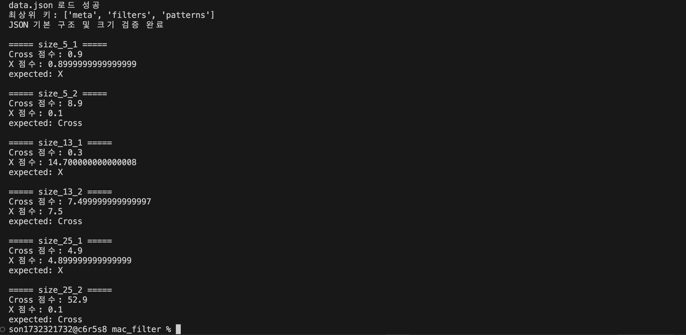
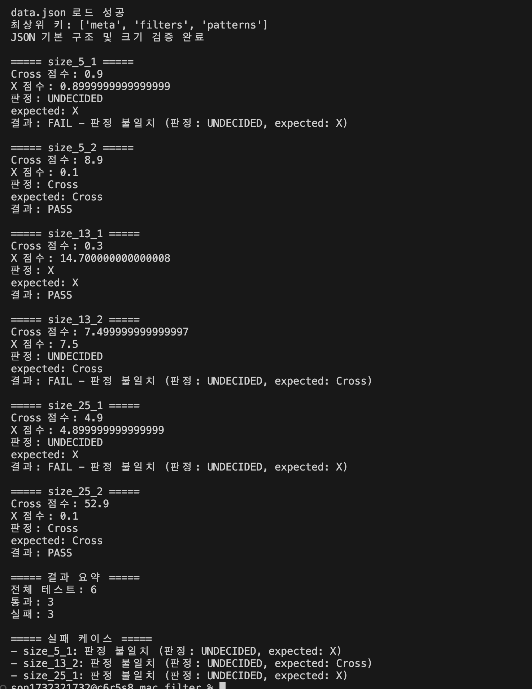
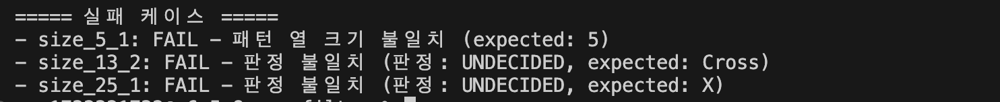
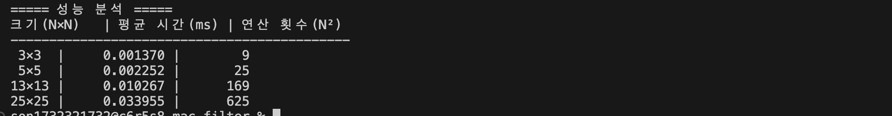
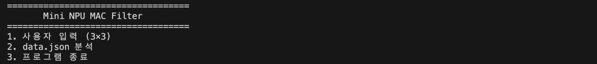

# Mini NPU 시뮬레이터 구현
#### 3×3부터 25×25까지 다양한 크기의 패턴과 필터에 MAC 연산을 적용하고 유사도 점수를 계산하여 Cross와 X를 판별하는 Mini NPU 시뮬레이터를 완성한다.JSON 데이터를 활용해 연산 횟수와 실행 시간을 비교하며 AI 연산의 기본 원리를 이해한다.

___

<dr>

>## 1. 실행 환경
- OS: macOS Sequoia 15.7.7
- Shell: zsh
- Python: 3.12.13
- Git: 2.54.0
- Editor : Visual Studio Code
- 사용 라이브러리: Python 표준 라이브러리 `json`, `time`만 사용
- NumPy, pandas 등 외부 라이브러리 사용하지 않음


>## 2. Mac 연산 실핼 기록

### ① 프로젝트 기본 구조 만들기

 ```zsh
MAC_FILTER/
│
├─ main.py.   # 실제 Python 콘솔 프로그램
├─ data.json  # 5×5, 13×13, 25×25 테스트 데이터(과제에서 제공)
└─ README.md  # 실행 방법, 결과 리포트, 실패 원인, 시간복잡도 작성
```

### ② MAC 연산 완성
- mac_score() 함수 작성
- score 변수 생성 및 초기화
- for i, for j로 행·열 순회
- 같은 위치의 값을 곱해 score에 누적
- 최종 MAC 점수 반환
- 2차원 리스트의 `pattern[i][j]`, `filter_data[i][j]`를 이용해 특정 위치의 값을 읽어 MAC 연산에 사용한다.

```zsh
def mac_score(pattern, filter_data):
    score = 0.0

    for i in range(len(pattern)):
        for j in range(len(pattern[i])):
            score += pattern[i][j] * filter_data[i][j] #같은 위치끼리 곱셈

    return score #최종 MAC 점수 반환
```
#### * MAC 연산 용어 & 기호
- **MAC** : Multiply-Accumulate, 곱하고 더하는 연산
- **Pattern** × Filter : 같은 위치의 값끼리 곱셈
- **Score** : 곱셈 결과를 모두 더한 값

### ③ 점수 판정 완성
- judge_score() 함수 작성
- 두 필터의 MAC 점수를 비교하여 A/B 판정
- 두 점수의 차이가 epsilon보다 작으면 UNDECIDED 처리
- epsilon = 1e-9 적용
- 부동소수점 계산에서 발생할 수 있는 미세한 오차를 고려하여
  단순한 == 비교 대신 허용오차 기반 비교를 사용

```zsh
# 점수 판정 추가
def judge_score(score_a, score_b):
    epsilon = 1e-9

    if abs(score_a - score_b) < epsilon:
        return "UNDECIDED"
    elif score_a > score_b:
        return "A"
    else:
        return "B"
```
#### * 판정 기준
- score_a > score_b → A
- score_b > score_a → B
- abs(score_a - score_b) < 1e-9 → UNDECIDED

- 실행화면 : 

### ④ 라벨 정규화 완성
- normalize_label() 함수 작성
- JSON의 다양한 라벨 표현을 프로그램 내부의 표준 라벨로 통일
- '+'와 'cross'는 'Cross'로 변환
- 'x'와 'X'는 'X'로 변환
- 앞뒤 공백 제거 및 대소문자 통일을 적용
- 지정되지 않은 라벨은 None을 반환하도록 처리

```zsh
def normalize_label(label):
    label = str(label).strip().lower()

    if label == "+" or label == "cross":
        return "Cross"
    elif label == "x":
        return "X"
    else:
        return None
```
#### * 라벨 정규화 규칙
- '+' → Cross
- 'cross' → Cross
- 'x' → X
- 'X' → X
- 그 외 값 → None

- 실행화면 : 

### ⑤ 3×3 사용자 입력 완성
- 3×3 필터 A, 필터 B, 패턴을 콘솔에서 입력받도록 구현
- 각 행은 공백으로 구분된 3개의 숫자를 입력하도록 구성
- 행마다 입력된 값의 개수가 3개인지 검증
- 숫자가 아닌 값이 입력되면 오류 메시지를 출력하고 재입력하도록 구현
- 입력된 값을 2차원 리스트 형태로 저장

```zsh
def read_matrix_3x3(name):
    print(f"\n{name} 입력")

    matrix = []

    for i in range(3):
        while True:
            row = input(f"{i + 1}행: ").split()

            if len(row) != 3:
                print("입력 형식 오류: 각 줄에 3개의 숫자를 공백으로 구분해 입력하세요.")
                continue

            try:
                row = [float(value) for value in row]
                matrix.append(row)
                break
            except ValueError:
                print("입력 형식 오류: 숫자만 입력하세요.")

    return matrix

filter_a = read_matrix_3x3("필터 A")
filter_b = read_matrix_3x3("필터 B")
pattern = read_matrix_3x3("패턴")
```
#### * 입력 검증 테스트
- `1` 입력 → 열 개수 오류 메시지 출력 후 재입력
- `0 0 ab` 입력 → 숫자 파싱 오류 메시지 출력 후 재입력
- 정상적인 3개의 숫자 입력 → 해당 행 저장

#### * 저장 구조
- 필터 A, 필터 B, 패턴 모두 다음과 같은
- 3×3 2차원 리스트 형태로 저장된다.  
  [
      [값, 값, 값],
      [값, 값, 값],
      [값, 값, 값]
  ]

- 실행화면 : 

### ⑥ 3×3 MAC 연산 및 판정 완성
- ⑤에서 입력받은 필터 A, 필터 B, 패턴을 MAC 연산 함수와 연결
- 필터 A와 패턴의 MAC 점수를 계산
- 필터 B와 패턴의 MAC 점수를 계산
- 두 점수를 judge_score()에 전달하여 판정
- A 점수가 높으면 A, B 점수가 높으면 B로 판정
- 두 점수의 차이가 epsilon보다 작으면 UNDECIDED로 판정

```zsh
score_a = mac_score(pattern, filter_a)
score_b = mac_score(pattern, filter_b)

result = judge_score(score_a, score_b)

print("\nMAC 결과")
print(f"필터 A 점수: {score_a}")
print(f"필터 B 점수: {score_b}")
print(f"판정 결과: {result}")
```
#### * 실행 결과
- 필터 A 점수 출력 확인
- 필터 B 점수 출력 확인
- A/B/UNDECIDED 판정 결과 출력 확인

#### * MAC 점수와 유사도의 관계
- MAC 점수는 패턴과 필터의 같은 위치 값을 곱한 후 모두 더하여 계산한다.
- 패턴과 필터가 같은 방향의 값을 가질수록 곱셈 결과가 커진다.
- 따라서 다른 필터보다 MAC 점수가 높으면 해당 필터의 특징과 더 많이 일치한다고 판단할 수 있다.
- 이러한 방식은 이미지 처리에서 특정 특징을 찾는 필터 연산의 기본 원리와 연결된다.

- 실행화면 : 
- 실행화면 : 
- 실행화면 : 

### ⑦ data.json 로드
- JSON 데이터는 data.json 파일(과제 데이타)로 준비하고, Python 표준 라이브러리인 json 모듈을 사용해 읽었다.
- load_json_data() 함수를 만들어 data.json을 열고, json.load()로 JSON 데이터를 Python 자료형으로 변환했다.
- 파일이 존재하지 않는 경우 `FileNotFoundError`를 처리하여 파일을 찾을 수 없다는 안내 메시지를 출력하도록 하였다.
- JSON 파일의 형식이 잘못된 경우에는 `JSONDecodeError`를 처리하여 JSON 형식 오류 메시지를 출력하도록 구현하였다.  
  (JSON 파일에 문제가 발생하더라도 프로그램이 예외로 종료되지 않고 사용자가 오류 원인을 확인할 수 있음)
- JSON 데이터를 data에 저장하고, 최상위 키를 출력해 filters와 patterns의 존재 여부를 확인한다.

```zsh
import json

. . .

def load_json_data(filename):
    try:
        with open(filename, "r", encoding="utf-8") as file:
            data = json.load(file)

        return data

    except FileNotFoundError:
        print(f"파일을 찾을 수 없습니다: {filename}")
        return None

    except json.JSONDecodeError:
        print(f"JSON 형식 오류: {filename}")
        return None

. . .

if data is not None:
    print("\ndata.json 로드 성공")
    print("최상위 키:", list(data.keys()))
```

- 실행화면 : 

### ⑧ JSON 스키마 및 크기 검증
- data.json의 기본 구조와 패턴 크기를 검증하였다.
- filters, patterns, size_5, size_13, size_25의 존재 여부와 각 패턴의 input, expected 및 N×N 크기를 확인하도록 구현하였다.
- 크기나 구조가 맞지 않을 경우 오류 메시지를 출력하여 프로그램이 중단되지 않도록 처리하였다.
- Cross 필터와 X 필터 역시 패턴과 동일하게 N×N 크기인지 검증하였다.
- 행 또는 열의 크기가 맞지 않는 경우 해당 케이스를 FAIL 처리하고 원인을 기록하였다.

```zsh
def validate_json_data(data):
    if not isinstance(data, dict):
        print("JSON 형식 오류: 최상위 데이터가 딕셔너리가 아닙니다.")
        return False

    if "filters" not in data:
        print("JSON 구조 오류: filters가 없습니다.")
        return False

    if "patterns" not in data:
        print("JSON 구조 오류: patterns가 없습니다.")
        return False

    filters = data["filters"]
    patterns = data["patterns"]

    if not isinstance(filters, dict):
        print("JSON 구조 오류: filters가 딕셔너리가 아닙니다.")
        return False

    if not isinstance(patterns, dict):
        print("JSON 구조 오류: patterns가 딕셔너리가 아닙니다.")
        return False

    required_sizes = [5, 13, 25]

    for size in required_sizes:
        key = f"size_{size}"

        if key not in filters:
            print(f"필터 오류: {key}가 없습니다.")
            return False

    for pattern_key, pattern_data in patterns.items():

        parts = pattern_key.split("_")

        if len(parts) < 3 or parts[0] != "size":
            print(f"패턴 키 형식 오류: {pattern_key}")
            continue

        try:
            size = int(parts[1])
        except ValueError:
            print(f"패턴 크기 오류: {pattern_key}")
            continue

        filter_key = f"size_{size}"

        if filter_key not in filters:
            print(f"{pattern_key}: 해당 필터 {filter_key}가 없습니다.")
            continue

        if not isinstance(pattern_data, dict):
            print(f"{pattern_key}: 데이터 형식 오류")
            continue

        if "input" not in pattern_data:
            print(f"{pattern_key}: input이 없습니다.")
            continue

        if "expected" not in pattern_data:
            print(f"{pattern_key}: expected가 없습니다.")
            continue

        input_data = pattern_data["input"]

        if len(input_data) != size:
            print(f"{pattern_key}: 행 크기 불일치")
            continue

        valid_rows = True

        for row in input_data:
            if len(row) != size:
                valid_rows = False
                break

        if not valid_rows:
            print(f"{pattern_key}: 열 크기 불일치")
            continue
        
        print("JSON 기본 구조 및 크기 검증 완료")
        return True

...

data = load_json_data("data.json")

if data is not None:
print("\ndata.json 로드 성공")
print("최상위 키:", list(data.keys()))

validate_json_data(data)
```
- 실행화면 : 


### ⑨ JSON 데이터 분석 및 라벨 정규화
- 각 패턴의 크기에 맞는 필터를 선택하여 Cross와 X의 MAC 점수를 계산하였다.
- JSON의 `expected`와 필터 키를 `Cross`, `X`로 정규화하여 출력하도록 구현하였다.

```zsh
def analyze_json_data(data):
    filters = data["filters"]
    patterns = data["patterns"]

    for pattern_key, pattern_data in patterns.items():

        parts = pattern_key.split("_")

        if len(parts) < 3 or parts[0] != "size":
            print(f"\n패턴 키 형식 오류: {pattern_key}")
            continue

        try:
            size = int(parts[1])
        except ValueError:
            print(f"\n패턴 크기 오류: {pattern_key}")
            continue

        filter_key = f"size_{size}"

        if filter_key not in filters:
            print(f"\n{pattern_key}: {filter_key} 필터가 없습니다.")
            continue

        pattern = pattern_data["input"]

        cross_filter = filters[filter_key]["cross"]
        x_filter = filters[filter_key]["x"]

        cross_label = normalize_label("cross")
        x_label = normalize_label("x")

        cross_score = mac_score(pattern, cross_filter)
        x_score = mac_score(pattern, x_filter)

        expected_label = normalize_label(pattern_data["expected"])

        print(f"\n===== {pattern_key} =====")
        print(f"{cross_label} 점수: {cross_score}")
        print(f"{x_label} 점수: {x_score}")
        print(f"expected: {expected_label}")
```
- 실행화면 : 

>## 3. 결과 리포트

### ① JSON 스키마·크기 검증 및 PASS/FAIL 결과 비교
- data.json의 기본 구조를 검증한다.
- filters와 patterns가 존재하는지 확인한다.
- size_5, size_13, size_25 필터가 존재하는지 확인한다.
- size_N_idx 형식의 패턴 키에서 N을 추출한다.
- 해당 size_N 필터를 선택한다.
- 패턴과 필터의 실제 크기가 N×N인지 검증한다.
- 크기나 스키마에 문제가 있으면 해당 케이스를 FAIL 처리하고 원인을 기록한다.
- 필터와 패턴의 구조 및 크기가 올바른지 확인하고 오류가 발생해도 프로그램이 중단되지 않고 해당 케이스만 FAIL 처리하도록 구현하였다..
- 정상적으로 MAC 계산이 완료되면 Cross/X/UNDECIDED 판정 결과를 얻는다.
- 판정 결과를 expected와 비교한다.
- 일치하면 PASS, 다르면 FAIL을 출력한다.

```zsh
if len(pattern) != size:
    reason = f"패턴 행 크기 불일치 (expected: {size})"
    print(f"\n{pattern_key}: FAIL - {reason}")
    failed += 1
    failed_cases.append((pattern_key, reason))
    continue
```
```zsh
for row in pattern:
    if len(row) != size:
        reason = f"패턴 열 크기 불일치 (expected: {size})"
        print(f"\n{pattern_key}: FAIL - {reason}")
        failed += 1
        failed_cases.append((pattern_key, reason))
        continue
```
- 실행화면 : 
- 실행화면 : 
  * 패턴의 열 크기가 5가 되어야 하지만 실제 데이터의 열 크기가 달라 크기 불일치 오류로 FAIL 처리되었다. 이 케이스는 의도적인 오류 데이터를 통해 크기 검증과 케이스 단위 FAIL 처리가 정상적으로 동작하는지 확인하였다.

### ② 입력 크기별 MAC 연산 시간 측정 및 성능 분석
- MAC 연산의 크기별 성능을 비교하기 위해 3×3, 5×5, 13×13, 25×25 크기의 패턴과 필터를 대상으로 측정하였다.
- 각 크기별 MAC 연산을 최소 10회 반복하여 측정하고, 측정된 시간을 평균 내어 평균 연산 시간을 계산하였다.
- 시간 측정에는 Python의 time 모듈에 있는 time.perf_counter()를 사용하였다.
- 입력 및 출력, 파일 읽기 시간은 제외하고 mac_score() 함수가 실행되는 구간만 측정하였다.
- 각 크기의 MAC 연산 횟수는 N × N, 즉 N²회이므로 크기별 연산 횟수도 함께 출력하였다.

```zsh
# =========================================================
# 3×3 성능 분석
# =========================================================
def measure_performance_3x3(filter_a, pattern):

    repeat = 10

    print("\n===== 성능 분석 =====")
    print("크기(N×N)   | 평균 시간(ms) | 연산 횟수(N²)")
    print("--------------------------------------------")

    total_time = 0.0

    for _ in range(repeat):

        start = time.perf_counter()

        mac_score(pattern, filter_a)

        end = time.perf_counter()

        total_time += (end - start) * 1000

    average_time = total_time / repeat
    operation_count = 3 * 3

    print(
        f"{3:>2}×{3:<2} | "
        f"{average_time:>12.6f} | "
        f"{operation_count:>8}"
    )

# =========================================================
# 전체 크기 성능 분석
# =========================================================

def measure_performance():

    sizes = [3, 5, 13, 25]
    repeat = 10

    print("\n===== 성능 분석 =====")
    print("크기(N×N)   | 평균 시간(ms) | 연산 횟수(N²)")
    print("--------------------------------------------")

    for size in sizes:

        # 테스트용 N×N 데이터 생성
        test_pattern = [
            [1.0 for _ in range(size)]
            for _ in range(size)
        ]

        test_filter = [
            [1.0 for _ in range(size)]
            for _ in range(size)
        ]

        total_time = 0.0

        for _ in range(repeat):

            start = time.perf_counter()

            mac_score(test_pattern, test_filter)

            end = time.perf_counter()

            total_time += (end - start) * 1000

        average_time = total_time / repeat
        operation_count = size * size

        print(
            f"{size:>2}×{size:<2} | "
            f"{average_time:>12.6f} | "
            f"{operation_count:>8}"
        )
```
```zsh
score_a = mac_score(pattern, filter_a)
score_b = mac_score(pattern, filter_b)

result = judge_score(score_a, score_b)

print("\n===== MAC 결과 =====")
print(f"필터 A 점수: {score_a}")
print(f"필터 B 점수: {score_b}")
print(f"판정 결과: {result}")

measure_performance_3x3(filter_a, pattern)
```

- 실행화면 : 

#### 성능 분석 및 시간 복잡도
  - 3×3 사용자 입력 모드에서는 measure_performance_3x3()를 사용하여 3×3 MAC 연산 시간만 측정한다.
  - JSON 분석 모드에서는 measure_performance()를 사용하여 3×3, 5×5, 13×13, 25×25의 MAC 연산을 각각   10회 반복 측정하고 평균 시간을 출력한다.
  - MAC 연산은 N×N 위치를 모두 계산하므로 연산 횟수는 N², 시간 복잡도는 O(N²)이다.
  - 입력 크기가 증가할수록 연산 횟수와 평균 처리 시간도 증가하는 것을 확인하였다.

### ⑫ 실행 모드 선택 및 기능 분리
- 프로그램 실행 시 기능이 자동으로 순차 실행되지 않도록 메뉴 선택 방식으로 구성하였다.
- 사용자는 실행 화면에서 원하는 기능을 선택할 수 있다.

```zsh
Mini NPU MAC Filter 
│ 
├── 1. 사용자 입력 (3×3) 
│      ├── 필터 A/B/패턴 입력 
│      ├── MAC 계산 
│      ├── A/B/UNDECIDED 판정 
│      └── 3×3 성능 분석 
│ 
├── 2. data.json 분석 
│      ├── JSON 로드 및 검증 
│      ├── MAC 계산 
│      ├── PASS/FAIL 
│      ├── 결과 요약 
│      └── 3×3/5×5/13×13/25×25 성능 분석 
│ 
└── 3. 프로그램 종료
```
- 실행화면 : 

#### * 실패 원인 분석
- 전체 테스트 결과를 출력하여 통과 및 실패 케이스를 확인하였다.
- 현재 `data.json` 분석 결과 6개의 테스트 중 3개가 PASS, 3개가 FAIL로 나타났다.
- `size_5_1`, `size_13_2`, `size_25_1`은 Cross와 X의 점수 차이가 매우 작아 `UNDECIDED`로 판정되었다.
- 이 결과는 `expected` 값과 실제 판정 결과가 일치하지 않아 FAIL로 처리되었다.
- `judge_score()`에서는 `epsilon = 1e-9`를 사용하여 부동소수점 오차를 고려하였다.
- 따라서 작은 소수점 차이를 실제 점수 차이로 잘못 판단하지 않도록 처리하였다.
- 또한 JSON의 구조나 크기가 잘못된 경우 해당 케이스만 FAIL 처리하고 프로그램이 중단되지 않도록 구현하였다.

#### **main.py 함수 구조 및 실행 모드 분리**
```zsh
main.py
│
├── mac_score()                    # MAC 연산
│
├── judge_score()                  # 점수 비교 및 A/B/UNDECIDED 판정
│
├── normalize_label()              # Cross/X 라벨 정규화
│
├── read_matrix_3x3()              # 3×3 사용자 입력 및 입력 검증
│
├── load_json_data()               # data.json 로드 및 예외 처리
│
├── validate_json_data()            # JSON 구조 및 크기 검증
│
├── analyze_json_data()             # JSON 데이터 MAC 분석 및 PASS/FAIL
│
├── measure_performance_3x3()       # 사용자 입력 모드의 3×3 성능 측정
│
├── measure_performance()           # JSON 모드의 3×3/5×5/13×13/25×25 성능 측정
│
├── run_mode1()                     # 사용자 입력 모드 실행
│
├── run_mode2()                     # data.json 분석 모드 실행
│
└── main()                          # 메뉴 선택 및 프로그램 실행
```
