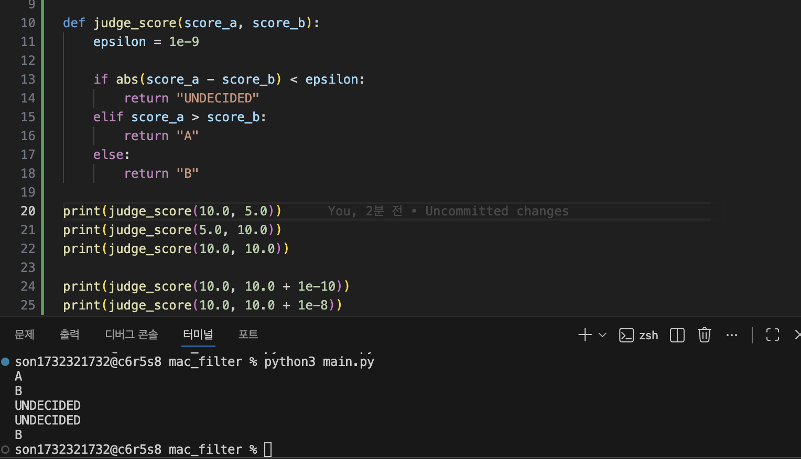
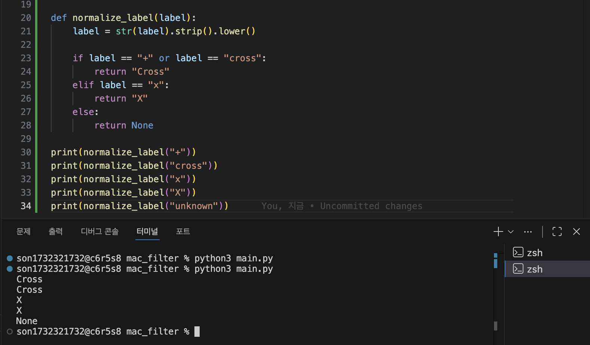

# Mini NPU 시뮬레이터 구현
#### 3×3부터 25×25까지 다양한 크기의 패턴과 필터에 MAC 연산을 적용하고 유사도 점수를 계산하여 Cross와 X를 판별하는 Mini NPU 시뮬레이터를 완성한다.JSON 데이터를 활용해 연산 횟수와 실행 시간을 비교하며 AI 연산의 기본 원리를 이해한다.

___

<dr>

>## 1. 실행 환경
- OS: macOS Sequoia 15.7.7
- Shell: zsh
- Python: 3.12.13
- Git: 2.54.0
- Editor : Visual Studio Code


>## 2. Mac 연산 실핼 기록

### ① 프로젝트 기본 구조 만들기

 ```zsh
MAC_FILTER/
│
├─ main.py.   # 실제 Python 콘솔 프로그램
├─ data.json  # 5×5, 13×13, 25×25 테스트 데이터
└─ README.md  # 실행 방법, 결과 리포트, 실패 원인, 시간복잡도 작성
```

### ② MAC 연산 완성
- mac_score() 함수 작성
- score 변수 생성 및 초기화
- for i, for j로 행·열 순회
- 같은 위치의 값을 곱해 score에 누적
- 최종 MAC 점수 반환

```zsh
def mac_score(pattern, filter_data):
    score = 0.0

    for i in range(len(pattern)):
        for j in range(len(pattern[i])):
            score += pattern[i][j] * filter_data[i][j] #같은 위치끼리 곱셈

    return score #최종 MAC 점수 반환
```
#### * MAC 연산 용어 & 기호
- **MAC** : Multiply-Accumulate, 곱하고 더하는 연산
- **Pattern** × Filter : 같은 위치의 값끼리 곱셈
- **Score** : 곱셈 결과를 모두 더한 값

### ③ 점수 판정 완성
- judge_score() 함수 작성
- 두 필터의 MAC 점수를 비교하여 A/B 판정
- 두 점수의 차이가 epsilon보다 작으면 UNDECIDED 처리
- epsilon = 1e-9 적용
- 부동소수점 계산에서 발생할 수 있는 미세한 오차를 고려하여
  단순한 == 비교 대신 허용오차 기반 비교를 사용

```zsh
# 점수 판정 추가
def judge_score(score_a, score_b):
    epsilon = 1e-9

    if abs(score_a - score_b) < epsilon:
        return "UNDECIDED"
    elif score_a > score_b:
        return "A"
    else:
        return "B"
```
#### * 판정 기준
- score_a > score_b → A
- score_b > score_a → B
- abs(score_a - score_b) < 1e-9 → UNDECIDED

- 실행화면 : 

### ④ 라벨 정규화 완성
- normalize_label() 함수 작성
- JSON의 다양한 라벨 표현을 프로그램 내부의 표준 라벨로 통일
- '+'와 'cross'는 'Cross'로 변환
- 'x'와 'X'는 'X'로 변환
- 앞뒤 공백 제거 및 대소문자 통일을 적용
- 지정되지 않은 라벨은 None을 반환하도록 처리

```zsh
def normalize_label(label):
    label = str(label).strip().lower()

    if label == "+" or label == "cross":
        return "Cross"
    elif label == "x":
        return "X"
    else:
        return None
```

#### * 라벨 정규화 규칙
- '+' → Cross
- 'cross' → Cross
- 'x' → X
- 'X' → X
- 그 외 값 → None

- 실행화면 : 

## 5. 라벨 정규화 함수 구현

다음으로 Cross / X 라벨을 통일해.

data.json에서는 여러 형태가 들어올 수 있으니까 별도의 함수로 만드는 게 좋아.

예:
```zsh
"+"      → Cross
"cross"  → Cross

"x"      → X
```
결국 프로그램 내부에서는 무조건:
```zsh
Cross
X
```
두 가지 형태만 사용하게 만드는 거야.

이걸 먼저 만들어 놓으면 나중에 expected 비교할 때 상당히 편해.

## 6. 3×3 사용자 입력 모드 구현

이제 사용자에게 직접 입력받는 기능을 붙여.

실행 흐름은:
```zsh
프로그램 시작
   ↓
모드 선택
   ↓
1. 사용자 입력
   ↓
필터 A 입력
   ↓
필터 B 입력
   ↓
저장 확인
   ↓
패턴 입력
   ↓
MAC 계산
   ↓
A/B 판정
   ↓
연산 시간 출력
```
입력 검증도 여기서 구현

예를 들어 3개가 아닌 숫자를 입력하면:
```zsh
입력 형식 오류:
각 줄에 3개의 숫자를 공백으로 구분해 입력하세요.
```
라고 출력하고 다시 입력받아야 해.

따라서 input_matrix(size) 같은 함수를 만들어 두면 좋아.
```zsh
input_matrix(3)
input_matrix(5)
input_matrix(13)
input_matrix(25)
```
이런 식으로 재사용할 수 있어.

## 7. data.json 로드 구현

3×3 사용자 입력이 완성되면 이제 JSON으로 넘어가.

먼저:
```zsh
import json
```
을 사용해서 data.json을 읽어.

그리고 과제에서 요구한 구조를 확인해.
```zsh
data.json
 ├─ filters
 │   ├─ size_5
 │   ├─ size_13
 │   └─ size_25
 │
 └─ patterns
     ├─ size_5_...
     ├─ size_13_...
     └─ size_25_...
```
이 단계에서는 계산보다 데이터 구조 확인이 먼저야.

## 8. JSON 스키마 검증

JSON을 읽은 다음 바로 계산하지 말고 검증부터 해야 해.

확인할 것:
```zsh
filters 존재?
   ↓
size_5 존재?
size_13 존재?
size_25 존재?
   ↓
patterns 존재?
   ↓
각 pattern의 input 존재?
expected 존재?
   ↓
패턴 크기와 필터 크기 일치?
```
문제가 있으면 프로그램이 죽으면 안 되고 해당 케이스를 FAIL로 처리해야 해.

예:
```zsh
Case: size_13_02
FAIL - 패턴 크기와 필터 크기가 일치하지 않음
```

## 9. JSON의 키에서 N 추출

이 부분이 과제에서 중요한 부분이야.

예를 들어:
```zsh
size_5_01
size_13_02
size_25_01
```
이면 키에서:
```zsh
5
13
25
```
를 추출해야 해.

그리고:
```zsh
5  → size_5 필터
13 → size_13 필터
25 → size_25 필터
```
를 선택하도록 만들면 돼.

즉 전체 흐름은:
```zsh
pattern key
     ↓
N 추출
     ↓
size_N 필터 선택
     ↓
크기 검증
     ↓
MAC 계산
```

## 10. JSON 전체 케이스 판정

이제 앞에서 만든 함수들을 연결하면 돼.

각 케이스마다:
```zsh
JSON 케이스
    ↓
N 추출
    ↓
필터 선택
    ↓
패턴 가져오기
    ↓
크기 검증
    ↓
Cross MAC
    ↓
X MAC
    ↓
판정
    ↓
expected 정규화
    ↓
PASS / FAIL
```
출력은 대략:
```zsh
[CASE] size_5_01
Cross Score : 12.5
X Score     : 4.2
Prediction  : Cross
Expected    : Cross
Result      : PASS
```
처럼 만들면 돼.

## 11. 성능 측정 기능 구현

기능이 모두 정상 작동한 뒤에 성능 측정을 붙이는 걸 추천해.

크기:
```zsh
3×3
5×5
13×13
25×25
```
각각 최소 10회 반복해서 측정해.

개념은:
```zsh
10회 MAC 실행
      ↓
각 실행 시간 측정
      ↓
평균 계산
      ↓
ms로 변환
```
Python에서는 time.perf_counter()를 사용하는 게 적합해.

중요한 점은 입력이나 출력 시간을 측정하면 안 되고 MAC 함수 실행 부분만 측정하는 거야.

## 12. 성능 결과 표 출력

측정 결과를 다음 형태로 출력하면 요구사항을 만족하기 좋아.
```zsh
========================================
성능 분석
========================================
크기       평균 시간(ms)      연산 횟수(N²)
3×3        0.0012             9
5×5        0.0028             25
13×13      0.0154             169
25×25      0.0531             625
```
여기서 N²는 MAC에서 수행하는 곱셈 횟수야.

## 13. 결과 리포트 구현

JSON 모드가 끝나면 마지막에 전체 결과를 집계해.
```zsh
========================================
결과 요약
========================================

전체 테스트 : 20
통과         : 18
실패         : 2

실패 케이스:
- size_13_03 : expected 라벨 불일치
- size_25_01 : 패턴 크기 불일치
```
이렇게 만들면 돼.

실패 케이스가 없으면:
```zsh
실패 케이스가 없습니다.
모든 테스트 PASS
```
라고 출력하면 되고.

## 14. README 작성

코드가 완성된 마지막 단계에서 README를 작성하는 걸 추천해.

README는 크게:
```zsh
1. 프로젝트 소개
2. 실행 방법
3. 프로그램 구조
4. 사용자 입력 모드
5. JSON 분석 모드
6. MAC 연산 설명
7. 라벨 정규화
8. epsilon 비교 정책
9. 성능 측정 결과
10. 결과 리포트
11. 실패 원인 분석
12. 시간 복잡도 분석
```
정도로 구성하면 좋아.

특히 과제에서 요구하는 10줄 이상의 결과 리포트에서는:
```zsh
데이터/스키마 문제
        vs
로직 문제
        vs
수치 비교 문제
```

## 전체 개발 순서 한눈에 보기

가장 중요한 순서만 다시 정리하면:
```zsh
① 프로젝트 파일 생성
        ↓
② 2차원 배열 처리
        ↓
③ MAC 함수 구현
        ↓
④ epsilon 기반 판정 함수
        ↓
⑤ Cross / X 라벨 정규화
        ↓
⑥ 3×3 사용자 입력
        ↓
⑦ 입력 검증
        ↓
⑧ data.json 로드
        ↓
⑨ JSON 스키마 검증
        ↓
⑩ key에서 N 추출 + 필터 선택
        ↓
⑪ JSON 전체 케이스 판정
        ↓
⑫ PASS / FAIL 집계
        ↓
⑬ 성능 측정(3/5/13/25)
        ↓
⑭ 성능 표 출력
        ↓
⑮ 결과 요약
        ↓
⑯ README 결과 리포트 작성
```
## 특히 추천하는 개발 전략

①~⑤까지만 먼저 완성해서 "MAC 엔진"을 만들고,
그 다음 ⑥~⑦에서 사용자 입력으로 검증하고,
그게 정상 작동하면 ⑧~⑫ JSON 기능을 붙이는 방식이 가장 좋아.

즉,
```zsh
MAC 계산 → 판정 → 입력 → JSON → 성능 → 리포트
```