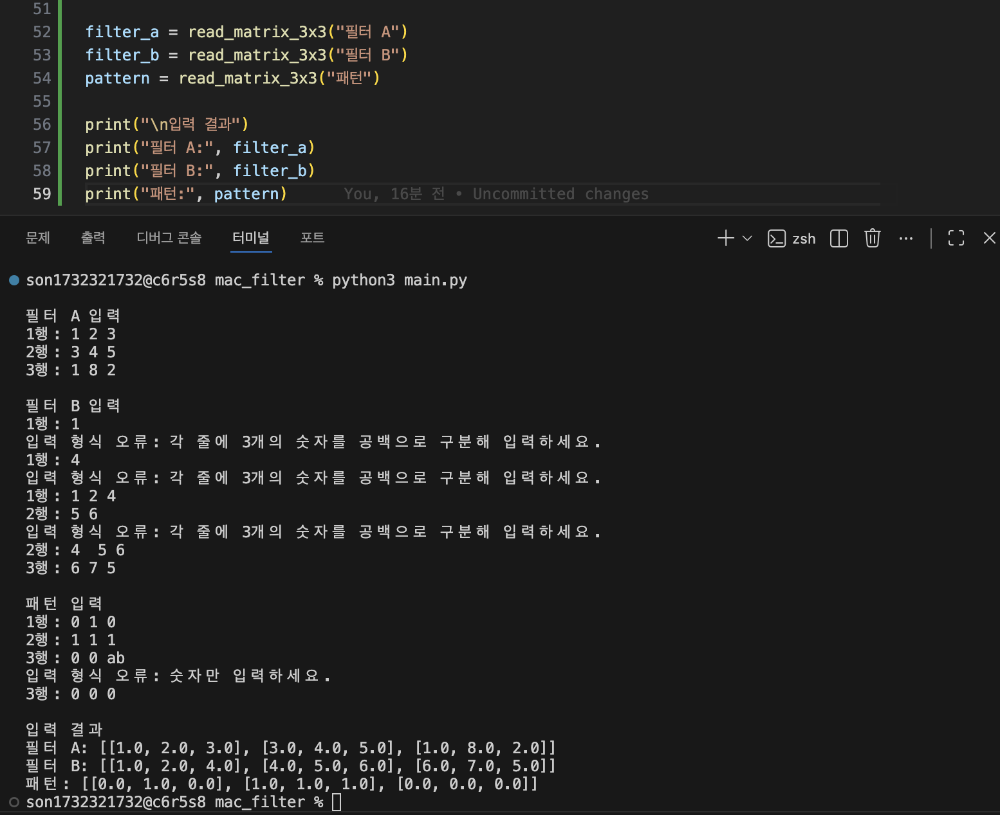
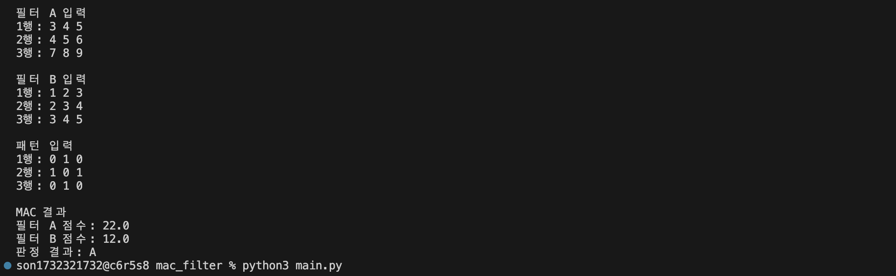
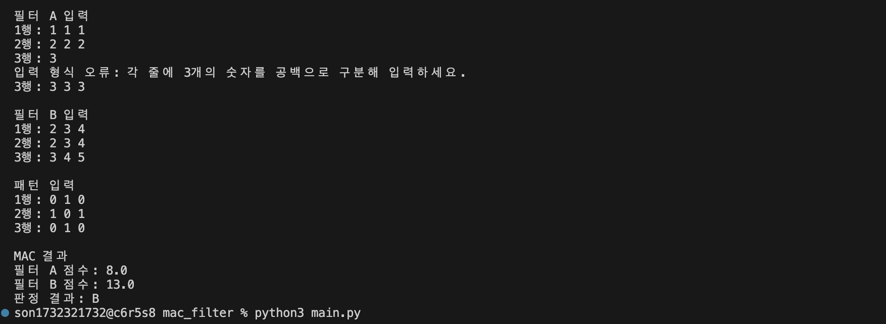
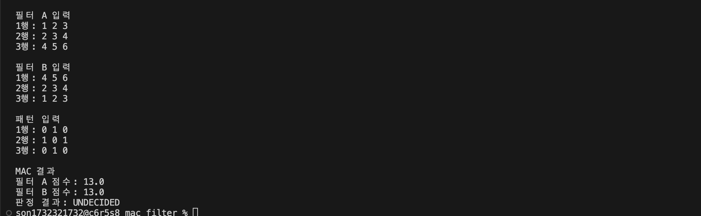
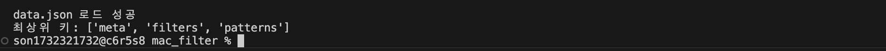
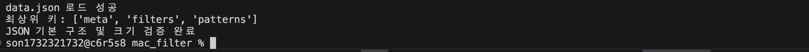

# Mini NPU 시뮬레이터 구현
#### 3×3부터 25×25까지 다양한 크기의 패턴과 필터에 MAC 연산을 적용하고 유사도 점수를 계산하여 Cross와 X를 판별하는 Mini NPU 시뮬레이터를 완성한다.JSON 데이터를 활용해 연산 횟수와 실행 시간을 비교하며 AI 연산의 기본 원리를 이해한다.

___

<dr>

>## 1. 실행 환경
- OS: macOS Sequoia 15.7.7
- Shell: zsh
- Python: 3.12.13
- Git: 2.54.0
- Editor : Visual Studio Code


>## 2. Mac 연산 실핼 기록

### ① 프로젝트 기본 구조 만들기

 ```zsh
MAC_FILTER/
│
├─ main.py.   # 실제 Python 콘솔 프로그램
├─ data.json  # 5×5, 13×13, 25×25 테스트 데이터(과제에서 제공)
└─ README.md  # 실행 방법, 결과 리포트, 실패 원인, 시간복잡도 작성
```

### ② MAC 연산 완성
- mac_score() 함수 작성
- score 변수 생성 및 초기화
- for i, for j로 행·열 순회
- 같은 위치의 값을 곱해 score에 누적
- 최종 MAC 점수 반환

```zsh
def mac_score(pattern, filter_data):
    score = 0.0

    for i in range(len(pattern)):
        for j in range(len(pattern[i])):
            score += pattern[i][j] * filter_data[i][j] #같은 위치끼리 곱셈

    return score #최종 MAC 점수 반환
```
#### * MAC 연산 용어 & 기호
- **MAC** : Multiply-Accumulate, 곱하고 더하는 연산
- **Pattern** × Filter : 같은 위치의 값끼리 곱셈
- **Score** : 곱셈 결과를 모두 더한 값

### ③ 점수 판정 완성
- judge_score() 함수 작성
- 두 필터의 MAC 점수를 비교하여 A/B 판정
- 두 점수의 차이가 epsilon보다 작으면 UNDECIDED 처리
- epsilon = 1e-9 적용
- 부동소수점 계산에서 발생할 수 있는 미세한 오차를 고려하여
  단순한 == 비교 대신 허용오차 기반 비교를 사용

```zsh
# 점수 판정 추가
def judge_score(score_a, score_b):
    epsilon = 1e-9

    if abs(score_a - score_b) < epsilon:
        return "UNDECIDED"
    elif score_a > score_b:
        return "A"
    else:
        return "B"
```
#### * 판정 기준
- score_a > score_b → A
- score_b > score_a → B
- abs(score_a - score_b) < 1e-9 → UNDECIDED

- 실행화면 : 

### ④ 라벨 정규화 완성
- normalize_label() 함수 작성
- JSON의 다양한 라벨 표현을 프로그램 내부의 표준 라벨로 통일
- '+'와 'cross'는 'Cross'로 변환
- 'x'와 'X'는 'X'로 변환
- 앞뒤 공백 제거 및 대소문자 통일을 적용
- 지정되지 않은 라벨은 None을 반환하도록 처리

```zsh
def normalize_label(label):
    label = str(label).strip().lower()

    if label == "+" or label == "cross":
        return "Cross"
    elif label == "x":
        return "X"
    else:
        return None
```

#### * 라벨 정규화 규칙
- '+' → Cross
- 'cross' → Cross
- 'x' → X
- 'X' → X
- 그 외 값 → None

- 실행화면 : 

### ⑤ 3×3 사용자 입력 완성
- 3×3 필터 A, 필터 B, 패턴을 콘솔에서 입력받도록 구현
- 각 행은 공백으로 구분된 3개의 숫자를 입력하도록 구성
- 행마다 입력된 값의 개수가 3개인지 검증
- 숫자가 아닌 값이 입력되면 오류 메시지를 출력하고 재입력하도록 구현
- 입력된 값을 2차원 리스트 형태로 저장

```zsh
def read_matrix_3x3(name):
    print(f"\n{name} 입력")

    matrix = []

    for i in range(3):
        while True:
            row = input(f"{i + 1}행: ").split()

            if len(row) != 3:
                print("입력 형식 오류: 각 줄에 3개의 숫자를 공백으로 구분해 입력하세요.")
                continue

            try:
                row = [float(value) for value in row]
                matrix.append(row)
                break
            except ValueError:
                print("입력 형식 오류: 숫자만 입력하세요.")

    return matrix

filter_a = read_matrix_3x3("필터 A")
filter_b = read_matrix_3x3("필터 B")
pattern = read_matrix_3x3("패턴")
```
#### * 입력 검증 테스트
- `1` 입력 → 열 개수 오류 메시지 출력 후 재입력
- `0 0 ab` 입력 → 숫자 파싱 오류 메시지 출력 후 재입력
- 정상적인 3개의 숫자 입력 → 해당 행 저장

#### * 저장 구조
- 필터 A, 필터 B, 패턴 모두 다음과 같은
- 3×3 2차원 리스트 형태로 저장된다.  
  [
      [값, 값, 값],
      [값, 값, 값],
      [값, 값, 값]
  ]

- 실행화면 : 

### ⑥ 3×3 MAC 연산 및 판정 완성
- ⑤에서 입력받은 필터 A, 필터 B, 패턴을 MAC 연산 함수와 연결
- 필터 A와 패턴의 MAC 점수를 계산
- 필터 B와 패턴의 MAC 점수를 계산
- 두 점수를 judge_score()에 전달하여 판정
- A 점수가 높으면 A, B 점수가 높으면 B로 판정
- 두 점수의 차이가 epsilon보다 작으면 UNDECIDED로 판정

```zsh
score_a = mac_score(pattern, filter_a)
score_b = mac_score(pattern, filter_b)

result = judge_score(score_a, score_b)

print("\nMAC 결과")
print(f"필터 A 점수: {score_a}")
print(f"필터 B 점수: {score_b}")
print(f"판정 결과: {result}")
```
#### * 실행 결과
- 필터 A 점수 출력 확인
- 필터 B 점수 출력 확인
- A/B/UNDECIDED 판정 결과 출력 확인

- 실행화면 : 
- 실행화면 : 
- 실행화면 : 

### ⑦ data.json 로드

- JSON 데이터는 data.json 파일(과제 데이타)로 준비하고, Python 표준 라이브러리인 json 모듈을 사용해 읽었다.
- load_json_data() 함수를 만들어 data.json을 열고, json.load()로 JSON 데이터를 Python 자료형으로 변환했다.
- 파일이 존재하지 않는 경우 `FileNotFoundError`를 처리하여 파일을 찾을 수 없다는 안내 메시지를 출력하도록 하였다.
- JSON 파일의 형식이 잘못된 경우에는 `JSONDecodeError`를 처리하여 JSON 형식 오류 메시지를 출력하도록 구현하였다.  
  (JSON 파일에 문제가 발생하더라도 프로그램이 예외로 종료되지 않고 사용자가 오류 원인을 확인할 수 있음)
- JSON 데이터를 data에 저장하고, 최상위 키를 출력해 filters와 patterns의 존재 여부를 확인한다.

```zsh
import json

. . .

def load_json_data(filename):
    try:
        with open(filename, "r", encoding="utf-8") as file:
            data = json.load(file)

        return data

    except FileNotFoundError:
        print(f"파일을 찾을 수 없습니다: {filename}")
        return None

    except json.JSONDecodeError:
        print(f"JSON 형식 오류: {filename}")
        return None

. . .

if data is not None:
    print("\ndata.json 로드 성공")
    print("최상위 키:", list(data.keys()))
```

- 실행화면 : 

### ⑧ JSON 스키마 및 크기 검증
- data.json의 기본 구조와 패턴 크기를 검증하였다.
- filters, patterns, size_5, size_13, size_25의 존재 여부와 각 패턴의 input, expected 및 N×N 크기를 확인하도록 구현하였다.
- 크기나 구조가 맞지 않을 경우 오류 메시지를 출력하여 프로그램이 중단되지 않도록 처리하였다.
```zsh
def validate_json_data(data):
    if not isinstance(data, dict):
        print("JSON 형식 오류: 최상위 데이터가 딕셔너리가 아닙니다.")
        return False

    if "filters" not in data:
        print("JSON 구조 오류: filters가 없습니다.")
        return False

    if "patterns" not in data:
        print("JSON 구조 오류: patterns가 없습니다.")
        return False

    filters = data["filters"]
    patterns = data["patterns"]

    if not isinstance(filters, dict):
        print("JSON 구조 오류: filters가 딕셔너리가 아닙니다.")
        return False

    if not isinstance(patterns, dict):
        print("JSON 구조 오류: patterns가 딕셔너리가 아닙니다.")
        return False

    required_sizes = [5, 13, 25]

    for size in required_sizes:
        key = f"size_{size}"

        if key not in filters:
            print(f"필터 오류: {key}가 없습니다.")
            return False

    for pattern_key, pattern_data in patterns.items():

        parts = pattern_key.split("_")

        if len(parts) < 3 or parts[0] != "size":
            print(f"패턴 키 형식 오류: {pattern_key}")
            continue

        try:
            size = int(parts[1])
        except ValueError:
            print(f"패턴 크기 오류: {pattern_key}")
            continue

        filter_key = f"size_{size}"

        if filter_key not in filters:
            print(f"{pattern_key}: 해당 필터 {filter_key}가 없습니다.")
            continue

        if not isinstance(pattern_data, dict):
            print(f"{pattern_key}: 데이터 형식 오류")
            continue

        if "input" not in pattern_data:
            print(f"{pattern_key}: input이 없습니다.")
            continue

        if "expected" not in pattern_data:
            print(f"{pattern_key}: expected가 없습니다.")
            continue

        input_data = pattern_data["input"]

        if len(input_data) != size:
            print(f"{pattern_key}: 행 크기 불일치")
            continue

        valid_rows = True

        for row in input_data:
            if len(row) != size:
                valid_rows = False
                break

        if not valid_rows:
            print(f"{pattern_key}: 열 크기 불일치")
            continue
        
        print("JSON 기본 구조 및 크기 검증 완료")
        return True

...

data = load_json_data("data.json")

if data is not None:
print("\ndata.json 로드 성공")
print("최상위 키:", list(data.keys()))

validate_json_data(data)
```
- 실행화면 : 


## 9. JSON의 키에서 N 추출

이 부분이 과제에서 중요한 부분이야.

예를 들어:
```zsh
size_5_01
size_13_02
size_25_01
```
이면 키에서:
```zsh
5
13
25
```
를 추출해야 해.

그리고:
```zsh
5  → size_5 필터
13 → size_13 필터
25 → size_25 필터
```
를 선택하도록 만들면 돼.

즉 전체 흐름은:
```zsh
pattern key
     ↓
N 추출
     ↓
size_N 필터 선택
     ↓
크기 검증
     ↓
MAC 계산
```

## 10. JSON 전체 케이스 판정

이제 앞에서 만든 함수들을 연결하면 돼.

각 케이스마다:
```zsh
JSON 케이스
    ↓
N 추출
    ↓
필터 선택
    ↓
패턴 가져오기
    ↓
크기 검증
    ↓
Cross MAC
    ↓
X MAC
    ↓
판정
    ↓
expected 정규화
    ↓
PASS / FAIL
```
출력은 대략:
```zsh
[CASE] size_5_01
Cross Score : 12.5
X Score     : 4.2
Prediction  : Cross
Expected    : Cross
Result      : PASS
```
처럼 만들면 돼.

## 11. 성능 측정 기능 구현

기능이 모두 정상 작동한 뒤에 성능 측정을 붙이는 걸 추천해.

크기:
```zsh
3×3
5×5
13×13
25×25
```
각각 최소 10회 반복해서 측정해.

개념은:
```zsh
10회 MAC 실행
      ↓
각 실행 시간 측정
      ↓
평균 계산
      ↓
ms로 변환
```
Python에서는 time.perf_counter()를 사용하는 게 적합해.

중요한 점은 입력이나 출력 시간을 측정하면 안 되고 MAC 함수 실행 부분만 측정하는 거야.

## 12. 성능 결과 표 출력

측정 결과를 다음 형태로 출력하면 요구사항을 만족하기 좋아.
```zsh
========================================
성능 분석
========================================
크기       평균 시간(ms)      연산 횟수(N²)
3×3        0.0012             9
5×5        0.0028             25
13×13      0.0154             169
25×25      0.0531             625
```
여기서 N²는 MAC에서 수행하는 곱셈 횟수야.

## 13. 결과 리포트 구현

JSON 모드가 끝나면 마지막에 전체 결과를 집계해.
```zsh
========================================
결과 요약
========================================

전체 테스트 : 20
통과         : 18
실패         : 2

실패 케이스:
- size_13_03 : expected 라벨 불일치
- size_25_01 : 패턴 크기 불일치
```
이렇게 만들면 돼.

실패 케이스가 없으면:
```zsh
실패 케이스가 없습니다.
모든 테스트 PASS
```
라고 출력하면 되고.

## 14. README 작성

코드가 완성된 마지막 단계에서 README를 작성하는 걸 추천해.

README는 크게:
```zsh
1. 프로젝트 소개
2. 실행 방법
3. 프로그램 구조
4. 사용자 입력 모드
5. JSON 분석 모드
6. MAC 연산 설명
7. 라벨 정규화
8. epsilon 비교 정책
9. 성능 측정 결과
10. 결과 리포트
11. 실패 원인 분석
12. 시간 복잡도 분석
```
정도로 구성하면 좋아.

특히 과제에서 요구하는 10줄 이상의 결과 리포트에서는:
```zsh
데이터/스키마 문제
        vs
로직 문제
        vs
수치 비교 문제
```

## 전체 개발 순서 한눈에 보기

가장 중요한 순서만 다시 정리하면:
```zsh
① 프로젝트 파일 생성
        ↓
② 2차원 배열 처리
        ↓
③ MAC 함수 구현
        ↓
④ epsilon 기반 판정 함수
        ↓
⑤ Cross / X 라벨 정규화
        ↓
⑥ 3×3 사용자 입력
        ↓
⑦ 입력 검증
        ↓
⑧ data.json 로드
        ↓
⑨ JSON 스키마 검증
        ↓
⑩ key에서 N 추출 + 필터 선택
        ↓
⑪ JSON 전체 케이스 판정
        ↓
⑫ PASS / FAIL 집계
        ↓
⑬ 성능 측정(3/5/13/25)
        ↓
⑭ 성능 표 출력
        ↓
⑮ 결과 요약
        ↓
⑯ README 결과 리포트 작성
```
## 특히 추천하는 개발 전략

①~⑤까지만 먼저 완성해서 "MAC 엔진"을 만들고,
그 다음 ⑥~⑦에서 사용자 입력으로 검증하고,
그게 정상 작동하면 ⑧~⑫ JSON 기능을 붙이는 방식이 가장 좋아.

즉,
```zsh
MAC 계산 → 판정 → 입력 → JSON → 성능 → 리포트
```